# MCP Appium Framework Diagrams

This document contains diagrams that illustrate the architecture, components, and workflows of the MCP Appium framework.

## System Architecture

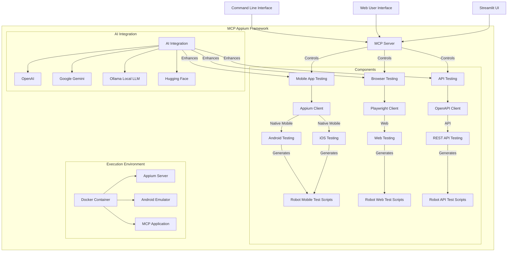

## User Workflow

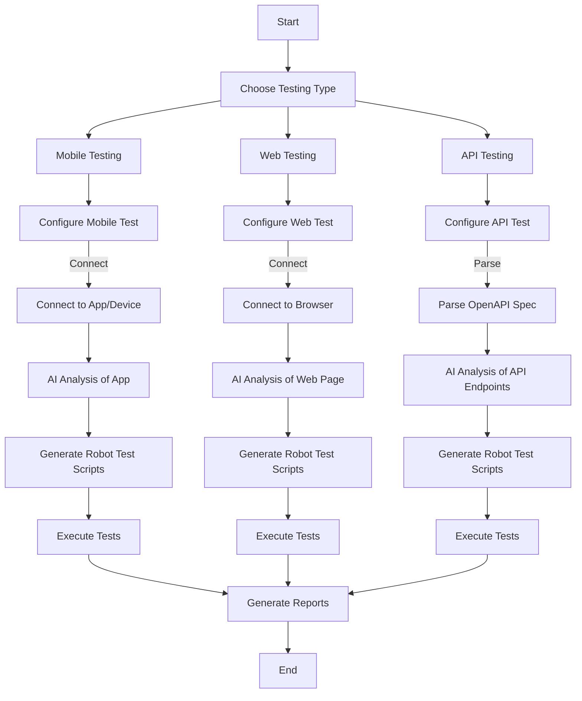

## Mobile Testing Flow

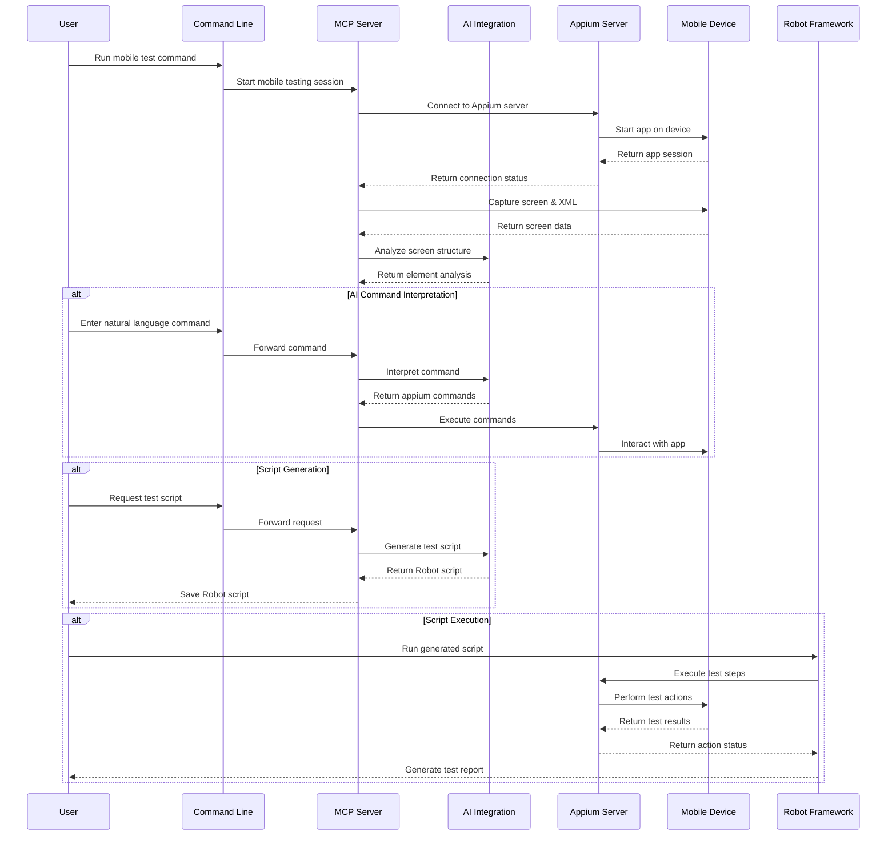

## Web Testing Flow

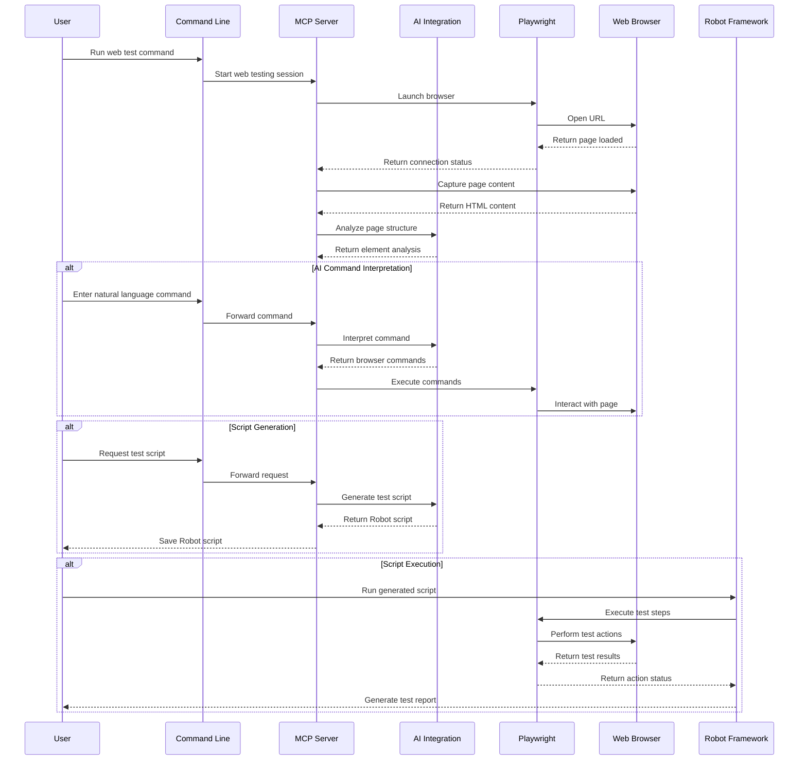

## API Testing Flow

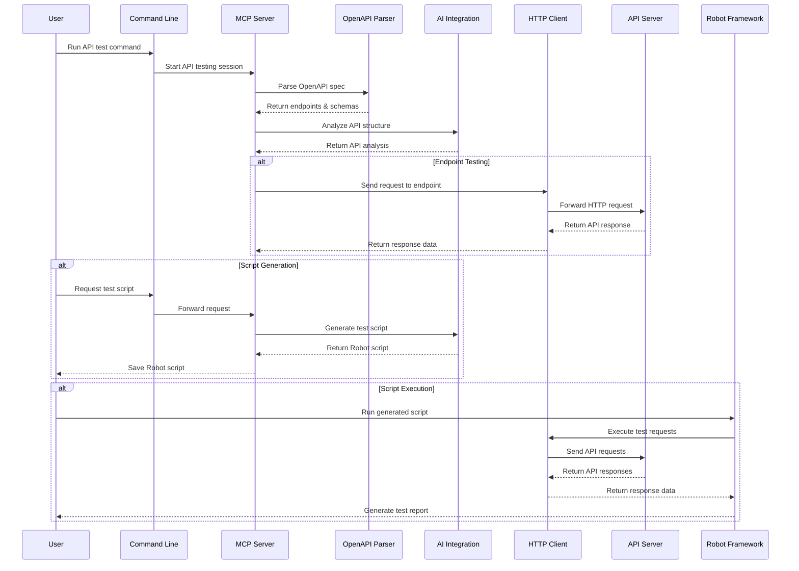

## AI Integration Flow

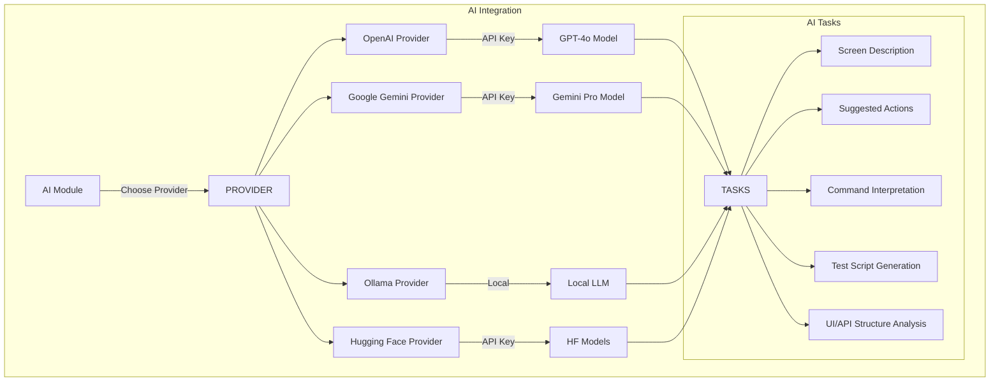

## Robot Framework Test Generation

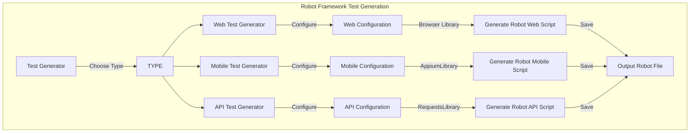

## Docker Deployment Flow

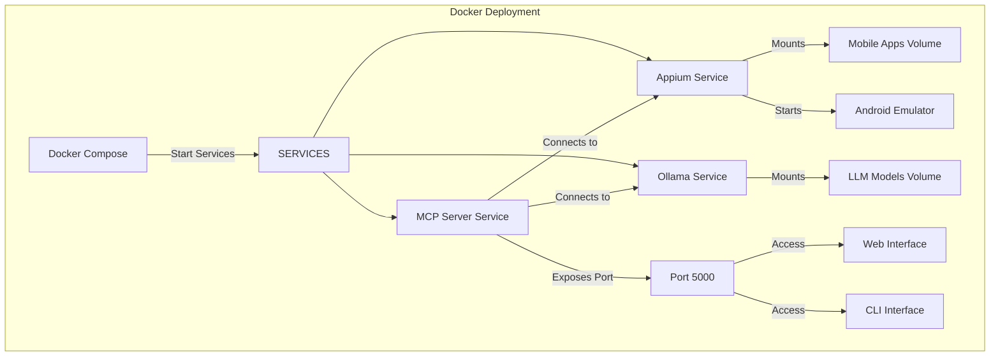

## Usage Example: Mobile Test Generation

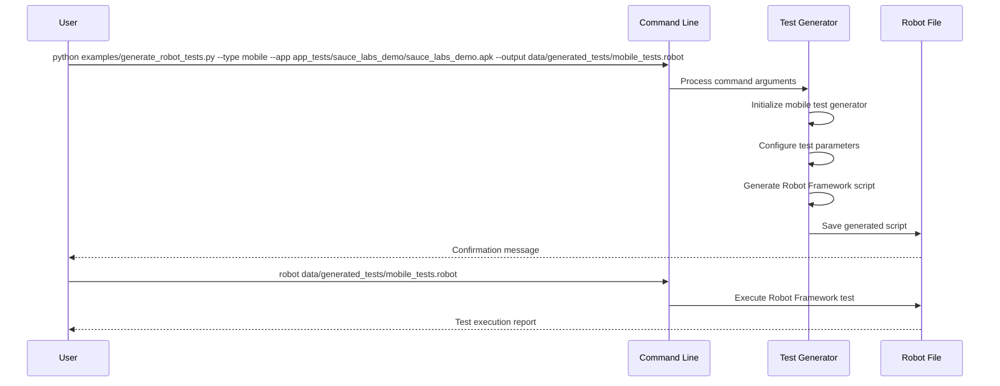

## Usage Example: Web Test Generation

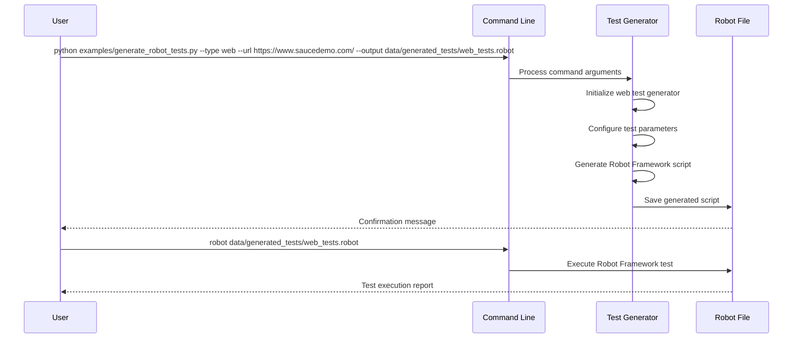

## Usage Example: API Test Generation

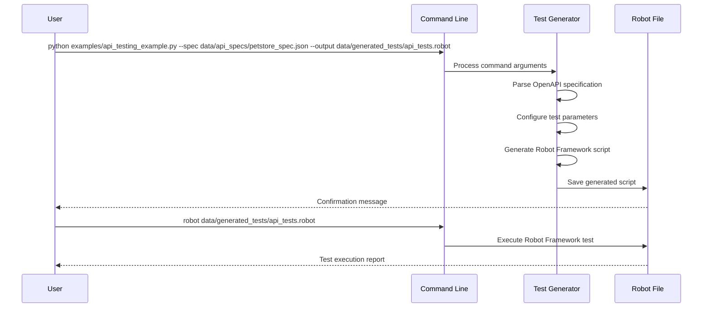