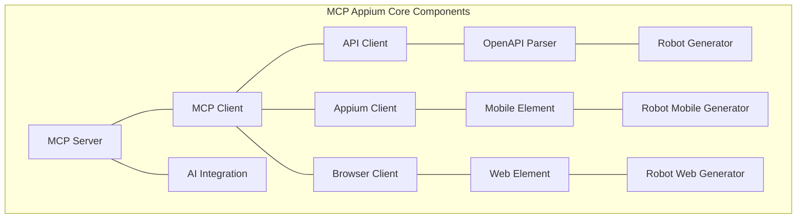
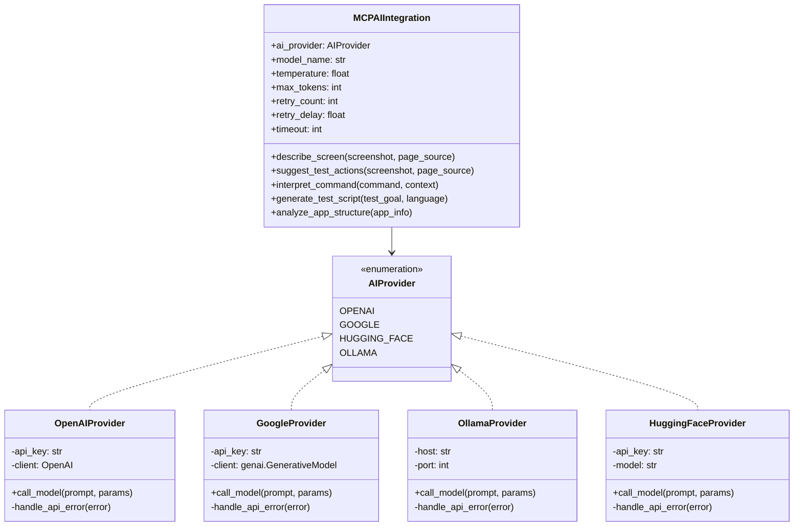
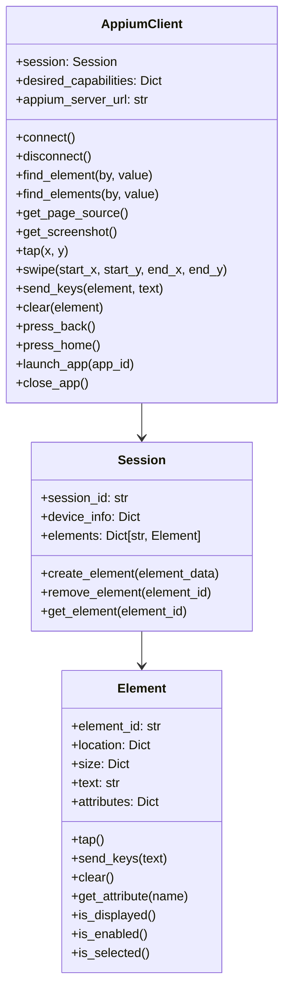
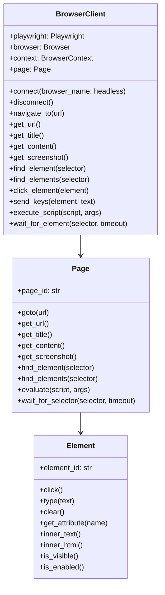
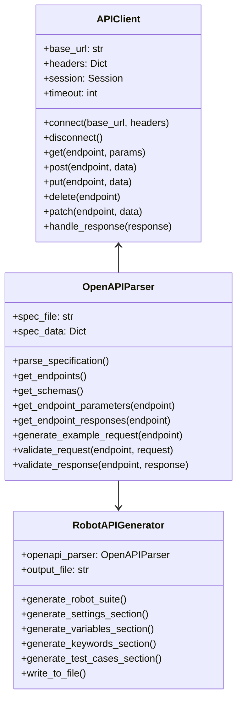
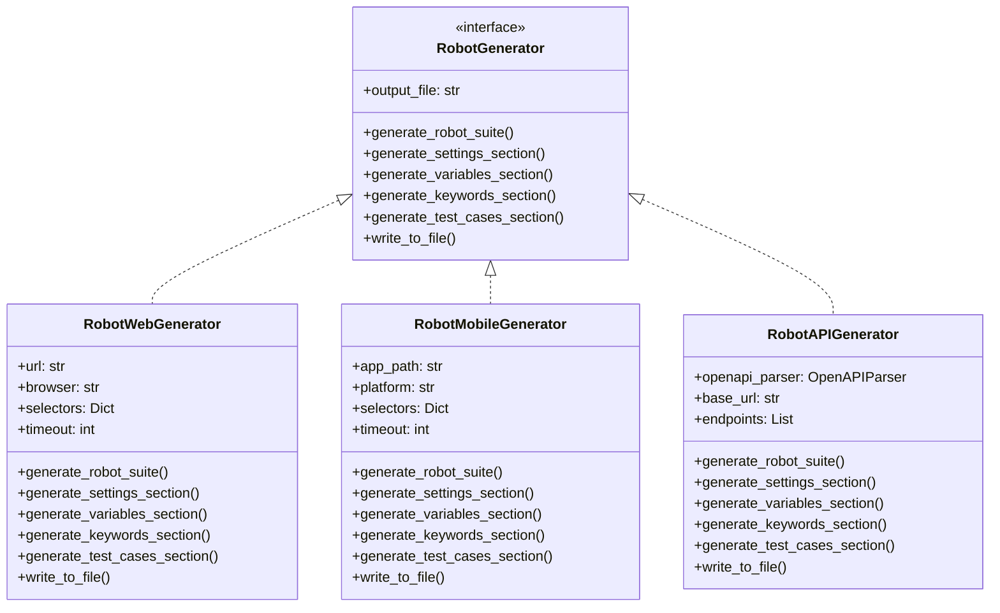
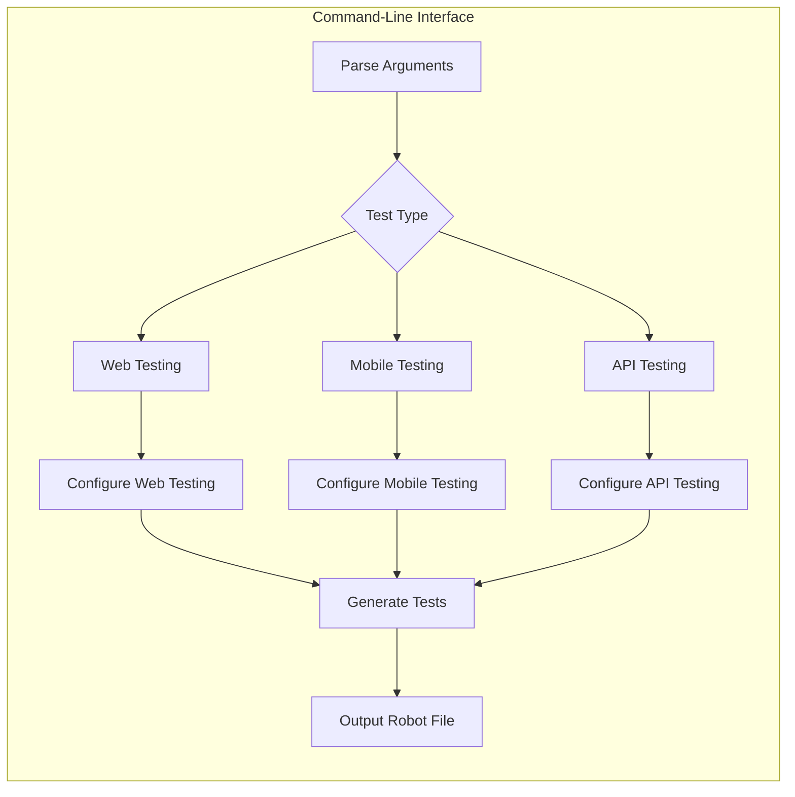

# MCP Appium Component Diagrams

This document contains detailed component diagrams for the MCP Appium framework.

## Main Components Interaction

## AI Integration Component Detail

## Appium Client Component Detail

## Browser Client Component Detail

## API Client Component Detail

## Robot Test Generation Components

## Command-Line Interface Flow

## File Structure and Organization

```mermaid
graph TB
    ROOT[Project Root] --> MCP[mcp_appium]
    ROOT --> EXAMPLES[examples]
    ROOT --> DOCS[docs]
    ROOT --> SCRIPTS[scripts]
    ROOT --> TESTS[tests]
    ROOT --> DATA[data]
    ROOT --> APP[app]
    
    MCP --> CORE[Core Modules]
    MCP --> API[API Module]
    MCP --> BROWSER[Browser Module]
    MCP --> MOBILE[Mobile Module]
    
    CORE --> INIT[__init__.py]
    CORE --> CLIENT[client.py]
    CORE --> CONFIG[config.py]
    CORE --> AI[ai_integration.py]
    CORE --> SERVER[server.py]
    CORE --> COMMANDS[commands.py]
    CORE --> ELEMENT[element.py]
    CORE --> UTILS[utils.py]
    
    API --> API_CLIENT[api_client.py]
    API --> API_PARSER[openapi_parser.py]
    API --> API_GEN[robot_generator.py]
    API --> API_RUNNER[api_test_runner.py]
    
    BROWSER --> BROWSER_CLIENT[browser.py]
    BROWSER --> BROWSER_PAGE[page.py]
    BROWSER --> BROWSER_ELEMENT[element.py]
    BROWSER --> BROWSER_CONTEXT[context.py]
    
    MOBILE --> MOBILE_CLIENT[mobile_client.py]
    MOBILE --> MOBILE_SESSION[session.py]
    MOBILE --> MOBILE_ELEMENT[element.py]
    
    EXAMPLES --> EX_ANDROID[android_example.py]
    EXAMPLES --> EX_WEB[web_browser_example.py]
    EXAMPLES --> EX_API[api_testing_example.py]
    EXAMPLES --> EX_ROBOT[generate_robot_tests.py]
    EXAMPLES --> EX_ROBOT_WEB[robot_web_generator.py]
    EXAMPLES --> EX_ROBOT_MOB[robot_mobile_generator.py]
    
    SCRIPTS --> SH_ANDROID[run_android_example.sh]
    SCRIPTS --> SH_WEB[run_browser_example.sh]
    SCRIPTS --> SH_API[run_api_example.sh]
    
    DOCS --> DOC_ARCH[ARCHITECTURE.md]
    DOCS --> DOC_BROWSER[BROWSER_AUTOMATION.md]
    DOCS --> DOC_USAGE[USAGE.md]
    DOCS --> DOC_DIAGRAMS[diagrams]
    
    DATA --> DATA_API[api_specs]
    DATA --> DATA_TESTS[generated_tests]
    DATA --> DATA_LOGS[logs]
    DATA --> DATA_SCREENSHOTS[screenshots]
```

